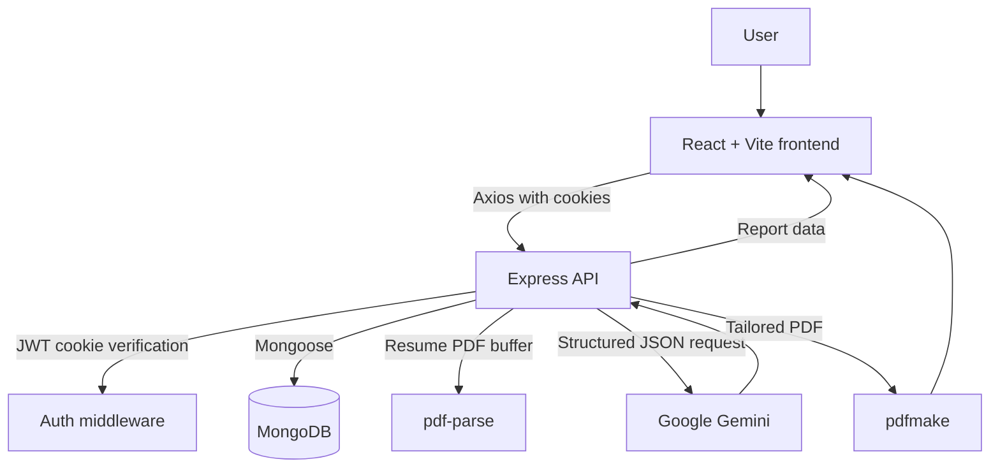

# InterviewPilot

> A full-stack interview-preparation app that turns a candidate profile and target job description into an actionable interview report.

InterviewPilot helps candidates prepare for a specific role by analyzing their resume, self-description, and job description. It generates a match score, technical and behavioral interview questions with suggested answers, skill gaps, and a day-by-day preparation plan.

## Features

- Register, sign in, sign out, and restore an authenticated session.
- Create an interview report from a job description, self-description, and uploaded resume PDF.
- Generate a match score, identified skill gaps, technical questions, behavioral questions, and a preparation roadmap.
- View previously generated reports belonging to the signed-in user.
- Download a tailored resume PDF derived from a job description and self-description.
- Keep generated reports in MongoDB and protect report endpoints by user identity.

## Screenshots

### Dashboard


The dashboard collects the target job description and candidate profile, then starts interview-report generation or a tailored-resume download.

### Resume


The resume view shows the generated PDF resume tailored to the supplied role and profile details.

### Registration


New users can create an account with a username, email address, and password.

### Login


Returning users sign in to access their protected dashboard and reports.

### Interview Report


The report presents interview questions, a preparation roadmap, match score, and skill gaps.

## User Flow

```text
User
  ↓
Register / Login
  ↓
Dashboard
  ↓
Job description + profile details + resume PDF
  ↓
Gemini interview analysis
  ↓
Saved interview report
  ↓
Questions, skill gaps, match score, and preparation roadmap
```

## Tech Stack

| Category              | Technology                                     |
| --------------------- | ---------------------------------------------- |
| Frontend              | React 19, Vite, React Router, Axios            |
| Backend               | Node.js, Express                               |
| Database              | MongoDB with Mongoose                          |
| Authentication        | JWT in HTTP cookies, bcryptjs, token blacklist |
| AI                    | Google GenAI SDK, `gemini-3.5-flash-lite`      |
| Styling               | Sass (SCSS)                                    |
| File and PDF handling | Multer, pdf-parse, pdfmake                     |

## Architecture



## Project Structure

```text
genAi/
├── Backend/
│   ├── src/
│   │   ├── config/          # MongoDB connection
│   │   ├── controllers/     # Authentication and interview handlers
│   │   ├── middlewares/     # JWT and upload middleware
│   │   ├── models/          # Mongoose schemas
│   │   ├── routes/          # Express API routes
│   │   └── services/        # Gemini and PDF-generation services
│   ├── .env.example
│   ├── package.json
│   └── server.js
├── Frontend/
│   ├── public/
│   ├── src/
│   │   ├── components/
│   │   └── features/        # Auth and interview pages, hooks, APIs, and styles
│   ├── package.json
│   └── vite.config.js
├── docs/screenshots/
├── .gitignore
└── README.md
```

## Backend

The backend is an Express application listening on port `3000`. It connects to MongoDB through Mongoose, parses JSON and cookies, and accepts cross-origin credentials from the Vite development server at `http://localhost:5173`.

- `auth.controller.js` handles registration, login, logout, and the current-user response.
- `interview.controller.js` parses an uploaded resume PDF, requests the AI interview report, persists it, retrieves reports, and serves tailored-resume PDFs.
- `auth.middleware.js` verifies the JWT held in the `token` cookie and rejects blacklisted tokens.
- `file.middleware.js` uses Multer memory storage with a 3 MB upload limit.
- `ai.service.js` calls Gemini; `resume.service.js` builds the downloadable PDF with pdfmake.

## Frontend

The frontend is a React single-page application built with Vite. React Router provides public `/login` and `/register` routes and protects the dashboard (`/`) and individual report (`/interview/:interviewId`) routes.

Auth and interview state are provided through React context and custom hooks. Axios clients send requests to `http://localhost:3000` with credentials enabled, so the browser includes the authentication cookie. Styling is authored in SCSS.

## AI / GenAI Integration

InterviewPilot uses the Google GenAI SDK with the `gemini-3.5-flash-lite` model to generate interview reports. The backend sends the extracted text from the uploaded resume PDF, the candidate's self-description, and the target job description in one prompt.

Gemini is configured to return `application/json` against a response schema. That schema requires a job title, a 0–100 match score, technical and behavioral questions (each with an interviewer intention and suggested answer), skill gaps with severity, and a day-wise preparation plan. The backend parses the returned JSON, saves it with the user and supplied inputs in MongoDB, and returns the stored report to the frontend.

The downloadable tailored resume is generated separately by the backend's PDF service; it is not an AI model-training workflow.

## API Endpoints

| Method | Endpoint                             | Description                                                          | Authentication |
| ------ | ------------------------------------ | -------------------------------------------------------------------- | -------------- |
| POST   | `/api/auth/register`                 | Create an account and set a JWT cookie.                              | No             |
| POST   | `/api/auth/login`                    | Authenticate a user and set a JWT cookie.                            | No             |
| GET    | `/api/auth/logout`                   | Clear the cookie and blacklist its token when present.               | No             |
| GET    | `/api/auth/get-me`                   | Return the authenticated user's public details.                      | Yes            |
| POST   | `/api/interview`                     | Parse the `resume` upload and generate and save an interview report. | Yes            |
| POST   | `/api/interview/generate-resume`     | Generate and return a tailored resume PDF.                           | Yes            |
| GET    | `/api/interview`                     | List the signed-in user's report summaries.                          | Yes            |
| GET    | `/api/interview/report/:interviewId` | Retrieve one report owned by the signed-in user.                     | Yes            |

## Authentication

Passwords are hashed with bcryptjs before storage. On registration and login, the backend creates a JWT valid for one day and sends it in a `token` cookie. Protected endpoints use middleware to read and verify that cookie. Logout clears it and stores the token in the MongoDB blacklist, preventing reuse of a logged-out token.

## Database

MongoDB stores the following Mongoose models:

| Model             | Stores                                                                                                            |
| ----------------- | ----------------------------------------------------------------------------------------------------------------- |
| `user`            | Unique username and email, plus the bcrypt-hashed password.                                                       |
| `InterviewReport` | The report's owner, supplied profile/job inputs, title, match score, questions, skill gaps, and preparation plan. |
| `BlacklistTokens` | Tokens invalidated during logout.                                                                                 |

## Environment Variables

Create `Backend/.env` from [`Backend/.env.example`](Backend/.env.example). Keep this file private—do not commit credentials, tokens, or API keys.

```env
MONGO_URI=your_mongodb_connection_string
JWT_SECRET=your_jwt_secret
GOOGLE_GENAI_API_KEY=your_google_genai_api_key
```

## Installation

Clone the repository and open it locally:

```bash
git clone <repository-url>
cd genAi
```

Start the backend in one terminal:

```bash
cd Backend
npm install
```

Create `Backend/.env` using `.env.example` as the template, then start the development server:

```bash
npm run dev
```

Start the frontend in a second terminal:

```bash
cd Frontend
npm install
npm run dev
```

Vite prints the local frontend URL (typically `http://localhost:5173`). The frontend is configured to call the backend at `http://localhost:3000`.

## Environment Setup

From `Backend`, copy the template and fill in your own MongoDB connection string, JWT secret, and Google GenAI API key:

```bash
Copy-Item .env.example .env
```

On macOS or Linux, use `cp .env.example .env` instead. Never share or commit the resulting `.env` file.

## Future Improvements

- Add automated backend and frontend tests.
- Add user-facing API and upload validation errors.
- Support configurable deployment URLs rather than local development URLs in source.
- Add file-type validation that aligns the upload control with backend parsing.

## Author

Samarth Gupta
